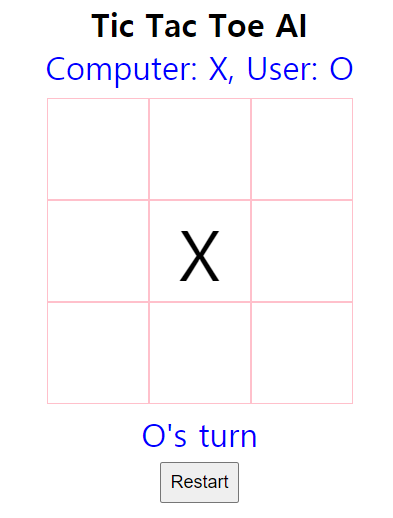

# Tic Tac Toe AI

- Web에서 실행 가능한 Tic Tac Toe 인공지능 프로그램입니다.

- 선(먼저 두는 선수)을 Random하게 선택하므로 컴퓨터가 선일 경우, index.html파일을 더블클릭하여 인터넷 브라우저로 띄웠을 때 그림처럼 컴퓨터가 먼저 한 수을 둘 경우도 있습니다.

- 다음 둘 선수를 보드 아래에 표시하도록 설계하였으나 컴퓨터가 두는 속도가 빨라서 항상 User('O')만 표시되는 것처럼 보입니다.

- tictactoe.js 파일은 전역변수와 함수만으로 구성되었으며, main.js파일은 비슷한 기능을 객체(Oject)에 모아서 구성해보았습니다. 이 둘의 기능상의 차이는 없습니다.

- 인공지능은 mimimax-alpha-beta algorithm을 적용하였습니다.

